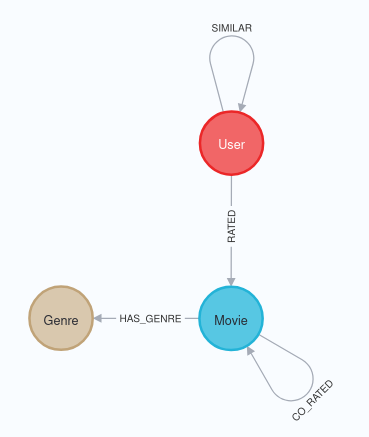
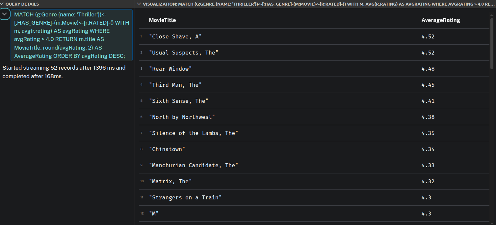
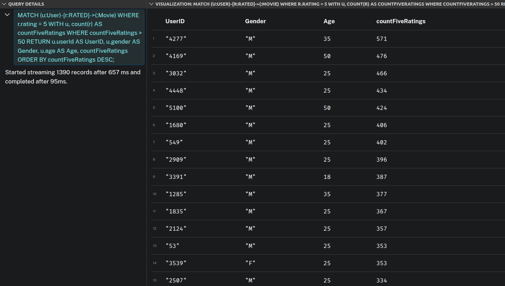
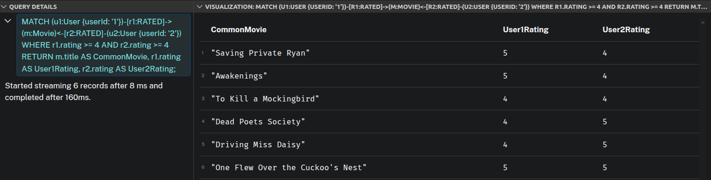
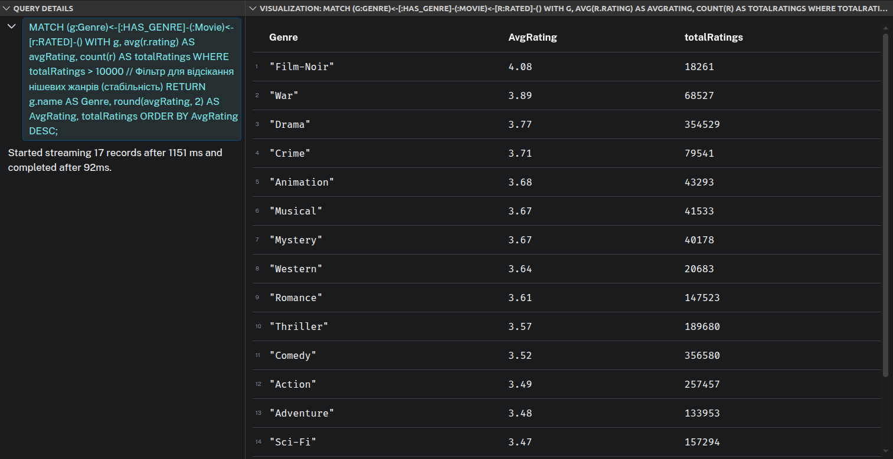
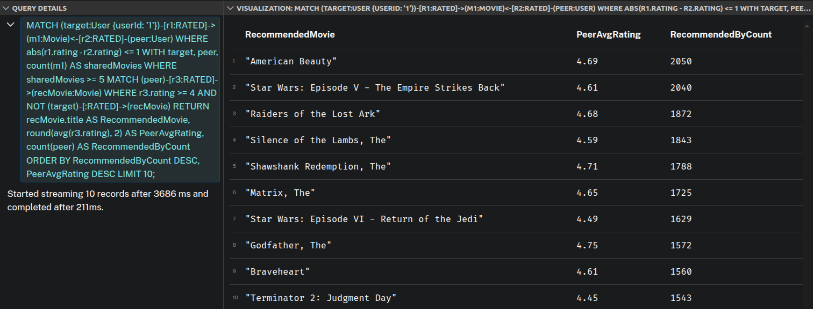
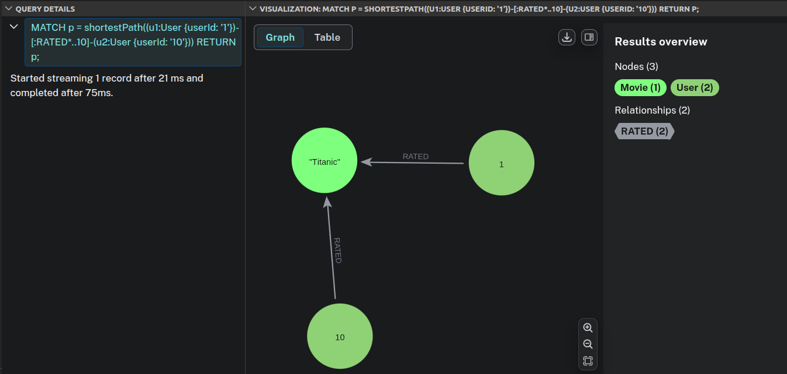
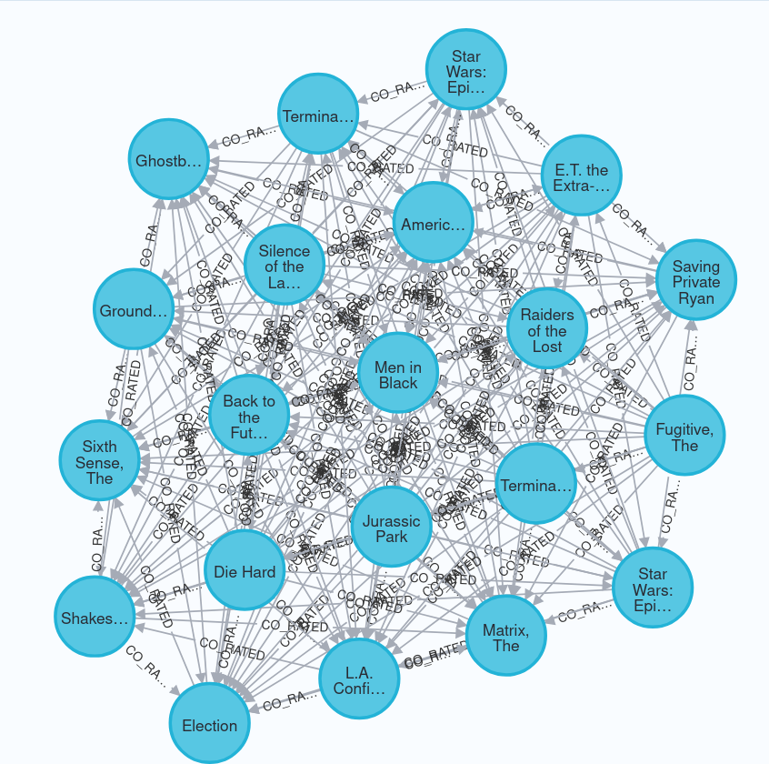
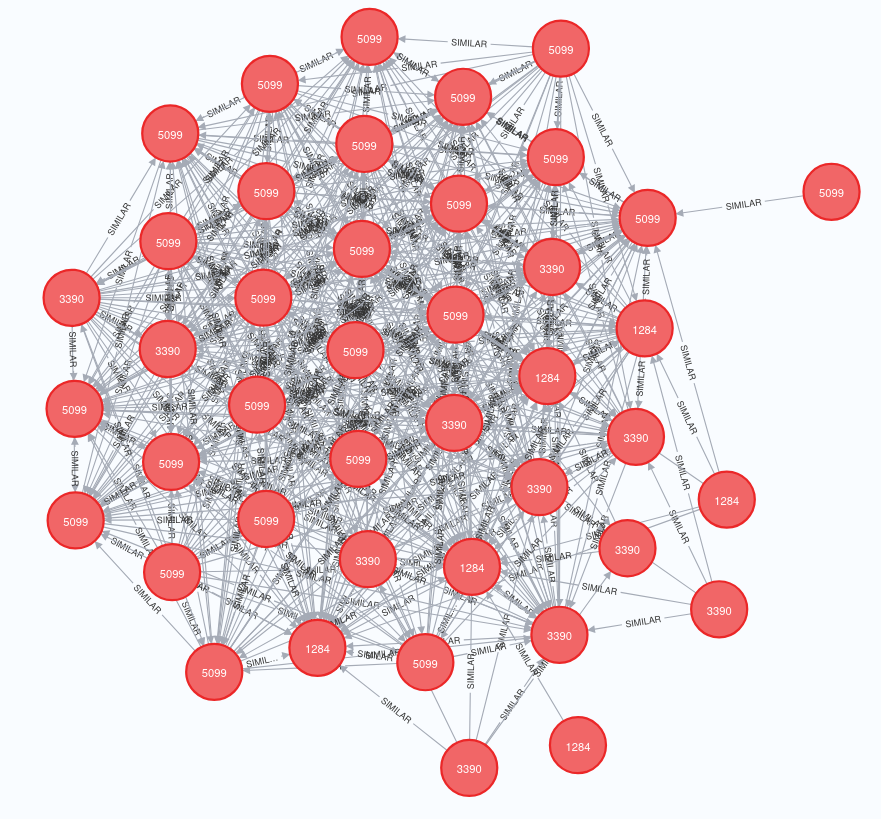

### Відповіді до **"Частина 1. Проєктування схеми"**  
  
### **1. Опис схеми графа**  
Було обрано наступну схему:  

   
  <em>Рис.1: Графова схема векторної бази даних </em>

В якості вузлів обрані наступні об'єкти:  
- *User* - користувач системи, який оцінює фільми. Властивості *User-а*: userId (унікальний ідентифікатор),  
gender (стать), age (вікова група у вигляді числа), occupation (код професії).

- *Movie* - представляє фільм, з наступними властивостями: movieId (унікальний ідентифікатор),  
title (назва фільму), year (рік випуску).  

- *Genre* - жанр фільма, з однією властивістю - назва жанру.  

Ребра характеризують наступні зв'язки:  
- ребро від користувача до фільму.  
**(:User)-[:RATED]->(:Movie)**  
Властивості ребра: rating (оцінка фільма від 1 до 5), timestamp (час оцінювання).

- ребро від фільму до жанру  
**(:Movie)-[:HAS_GENRE]->(:Genre)**  

*User, Movie, Genre* було обрано вузлами тому що це самостійні сутності які мають власні унікальні  
ідентифікатори та характеристики.  
Ребра *RATED, HAS_GENRE* відображають логічний зв'язок між сутностями.  
Було обрано таку структуру тому що графові бази даних найкраще працюють, коли сутності з високою  
щільністю зв'язків стають вузлами, а процеси взаємодії між ними — ребрами.

**2. Оцінка користувача — це ребро (User)-[:RATED]->(Movie) чи окремий вузол (Rating)?**  
Розглянемо переваги та недоліки кожного з підходів.  
1. Оцінка як ребро *(User)-[:RATED {rating: 5}]->(Movie)*  
Переваги:
- максимальна продуктивність, оскільки шлях від користувача до його фільмів займає рівно 1 перехід.  
- економія пам'яті (RAM/Disk), оскільки створення ребер потребує значно менше ресурсів, ніж створення  
вузлів та ребер до них.  
Недоліки:  
- Неможливість розширення оцінки. Якщо в майбутньому знадобиться зберегти, наприклад, коментарі до  
оцінки, то зробити це буде неможливо без зміни архітектури.

2: Оцінка як проміжний вузол *(User)-[:MADE]->(Rating)-[:FOR_MOVIE]->(Movie)*  
Переваги:
- розширюваність - для складної оцінки вузол легко масштабувати.  

Недоліки:  
 - Зменшення швидкості пошуку, оскільки для рекомендацій потрібно робити 2 хопи  
 *(-[:MADE]->()<-[:FOR_MOVIE]-)* замість одного.  

Отже, оскільки MovieLens статичний датасет, де швидкість обходу графа є головним  
пріоритетом, то модель із ребром є оптимальною.

**3. Чому жанри фільму вигідніше зберігати як окремі вузли (Genre), а не як список**  
**у властивості вузла Movie?**  
Серед переваг даного підходу є:
- Швидкість пошуку  
Якщо жанри це окремі вузли, то запит типу "Знайти топ-фільми у певному жанрі, які дивилися  
схожі користувачі" виконується миттєво, оскільки база даних просто бере вузол і йде за його  
ребрами назад до фільмів. Якщо жанри всередині рядка чи масиву фільму — базі доведеться робити  
сканування властивостей (Property Scan) або важкий індексний пошук по масивах.  
- Можливість використати Graph Data Science (GDS) методи  
Більшість алгоритмів (наприклад PageRank, Louvain) аналізують структуру зв'язків, і якщо жанр це  
властивість, то алгоритми GDS його не бачать.  

### Відповіді до **"Частина 2. Завантаження даних"**  
1. **Пояснення до коду в part2_load.cypher**  
Перед завантаженням даних було створено обмеження (Constraints), які гарантують унікальність  
відповідних полів вузла та одночасно створюють індекс для нього.  
Конструкція *IF NOT EXISTS* запобігає виникненню помилок, якщо скрипт запускається повторно.  
`LOAD CSV WITH HEADERS FROM 'file:///users.csv' AS row`  
`MERGE (u:User {userId: row.userId})`  
`ON CREATE SET ...`  
Вище наведений код читає CSV-файл з папки *import* Docker-контейнера. *MERGE* працює як  
"ідемпотентний оператор" (Get or Create), він перевіряє, чи існує вже користувач  
із таким userId, якщо так просто перевикористовує його, якщо ні — створює новий вузол.  
*ON CREATE SET* забезпечує, що  властивості записуються у вузол тільки в момент його першого створення.  
При завантаженні фільмів та жанрів створюється два типи вузлів та зв'язок між ними.  
Реалізовано парсинг назви фільму щоб виокремити рік випуску та зберегти його як властивість вузла.  
Для завантаження ребер було використано метод *apoc.periodic.iterate*, який читає CSV файл, шукає (MATCH)  
заздалегідь проіндексовані вузли користувача та фільму, а потім створює ребро [:RATED]. Ребра завантажуються  
батчами по 10000, після чого транзакція комітиться, а пам'ять очищується.  

### Відповіді до **"Частина 3. Запити різної складності"**  
1. **Пояснення до коду в part3.cypher**  
- Фільми жанру Thriller  
Запит починається з вузла *(g:Genre {name: 'Thriller'})*, далі граф розгортається до пов'язаних фільмів (m:Movie)  
та їхніх оцінок. Оператор *WITH m, avg(r.rating) AS avgRating* групує оцінки за кожним фільмом, після розрахунку  
середнього значення застосовується фільтр WHERE avgRating > 4.0.  

   
  <em>Рис.2: Результати виконання запиту 1 </em>

- Оцінка 5 більше 50 разів  
Спочатку ми фільтруємо ребра за допомогою умови *WHERE r.rating = 5*, потім за допомогою  
*WITH u, count(r) AS countFiveRatings* підраховуємо кількість таких ребер для кожного користувача і залишаємо  
лише тих, у кого лічильник перевищує 50.  

   
  <em>Рис.3: Результати виконання запиту 2 </em>

- Спільні фільми двох користувачів:  
Використовується паттерн "v-структури": *(u1)-[]->(m)<-[]-(u2)*. Пошук відбувається одночасно з двох боків  
(від u1 та u2). Вони "зустрічаються" на спільному вузлі m. Умова WHERE гарантує, що обидва користувачі оцінили  
цей фільм щонайменше на 4 бали.  

   
  <em>Рис.4: Результати виконання запиту 3 </em>

- Стабільні та популярні жанри  
ЛДля кожного жанру обчислюється середній рейтинг та загальна кількість оцінок. Для забезпечення характеристики  
стабільності введено фільтр *WHERE totalRatings > 10000*, без нього перші місця посіли б нішеві або рідкісні жанри,  
які мають небагато оцінок.  

   
  <em>Рис.5: Результати виконання запиту 4 </em>

- Рекомендація «користувачі зі схожими смаками також дивилися»  
Спочатку знаходимо "однодумців" (peer), які дивилися ті самі фільми, що й target, і поставили схожі оцінки  
*(abs(r1.rating - r2.rating) <= 1)*, далі фільтруємо людей з якими замало спільнихфілбмів *(count(m1) >= 5)*.  
Нарешті, шукаємо фільми recMovie, які однодумці похвалили *(r3.rating >= 4)*, але наш користувач їх ще не оцінював  
*(NOT (target)-[:RATED]->(recMovie))*.  

   
  <em>Рис.6: Результати виконання запиту 5 </em>

- Найкоротший ланцюжок зв'язку:  
Використано вбудовану функцію *shortestPath*. Запис [:RATED*..10] означає, що ми дозволяємо обхід по ребрах типу RATED  
будь-якого напрямку (оскільки стрілочка у зв'язку не вказана) глибиною до 10 кроків.

   
  <em>Рис.7: Результати виконання запиту 6 </em>

2. **Що означає довжина шляху в даному контексті?**  
Довжина шляху — це кількість ребер, які потрібно пройти від початкового вузла до кінцевого. Оскільки кожне ребро RATED  
завжди сполучає людину та фільм, то будь-який парний крок повертає нас до сутності того самого типу, з якого ми почали.  

3. **Як інтерпретувати шлях довжини 4? Довжини 6?**  
*Шлях довжини 4*  
Користувач А та Користувач С не мають жодного спільного переглянутого фільму. Проте, Користувач А дивився Фільм X разом  
із Користувачем Б, а користувач Б, своєю чергою, дивився Фільм Y разом із Користувачем С. Це концепція "друга мого друга",  
де користувач Б виступає "містком" смаків між користувачами А і С.  
*Шлях довжини 6*  
Глибокий зв'язок через трьох посередників та три різні фільми:  
Користувач А ➡️ Фільм 1 ➡️ Користувач Б ➡️ Фільм 2 ➡️ Користувач В ➡️ Фільм 3 ➡️ Користувач Г.  
Це прояв соціологічної теорії 6 рукостискань, що показує, наскільки щільним є граф.  

### Відповіді до **"Частина 4. Виявлення супервузлів"**  
1. **Пояснення до коду в part4_supernodes.cypher**  
Усі три запити побудовані за схожим паттерном: *MATCH (v)-->()* або *MATCH (v)<--()*, де ми шукаємо  
вузли конкретного лейблу та напрямок їхніх ребер. *WITH v, count(r) AS degree* виконує підрахунок ступеня вузла.  
*ORDER BY degree DESC LIMIT 10* сортує результати за спаданням, виводячи на вершину супервузли.  
2. **Які вузли виявилися супервузлами? Скільки у них зв’язків?**  
Користувач з userId: **4169** поставив найбільше оцінок - 2314.  
Найбільшу кількість оцінок має фільм "American Beauty (1999)" — 3428 оцінок (його оцінило понад 56% усіх користувачів бази).  
Найбільшими супервузлами в базі є жанри Drama (пов'язано 1603 фільми) та Comedy (пов'язано 1200 фільмів)  

3. **Чому запит, що зачіпає супер вузол, працює повільніше, ніж запит по «звичайному» вузлу з тими самими індексами?**  
Навіть якщо у нас створені індекси, запити до супервузлів призводять до значного падіння продуктивності бази даних  
з наступних причин:
- як тільки база даних стає на супер вузол, їй потрібно зчитати його список суміжності, що через велику кількість ребер, які  
виходять з супер вузла створює величезне навантаження на CPU  
- якщо під час обходу графа алгоритм потрапляє на фільм супер вузол, то він змушений розгалужуватися на тисячі нових напрямків  
(до кожного користувача), тому проходження через такий супервузол миттєво збільшує дерево пошуку до мільйонів варіантів,  
що викликає таймаут або помилку OutOfMemory.  

4. **Яку конкретну стратегію з лекцій ви б застосували для цього датасету?**  
- при аналізі супер фільмів варто скоротити кількість ребер, якими потрібно проходити. Наприклад, якщо фільм має понад 2000 оцінок,  
то алгоритм під час обходу випадковим чином обирає або враховує лише 100 з них.  
- під час аналізу супер користувачів можна застосувати партиціонування за часом -відсортувати їхні зв'язки за часом,  
і залишити лише останні 100–200 переглядів, щоб не спотворювати глобальну модель.  
- для уникнення жанрових супер вузлів можна зберегати жанри не як окремий вузол, а як окрема властивість для вузла фільм.  
Таким чином, структура графа стає чистою, а жанри використовуються лише на фінальному етапі як фільтри.  

### Відповіді до **"Частина 5. Графові алгоритми через GDS"**  
1. **Пояснення до коду в part5_gds.cypher**  
**PageRank алгоритм**  
На Кроці 3 ми викликали *gds.pageRank.stream* з параметром relationshipWeightProperty: 'weight',  
це означає, що сила передачі "авторитету" від одного фільму до іншого залежить від кількості реальних  
людей, які високо оцінили обидва ці фільми.  
Високий PageRank для фільму це не просто ознака популярності, яка рахує лише кількість оцінок фільму,  
натомість PageRank враховує структуру зв'язків. Фільм отримує високий бал, якщо він міцно пов’язаний  
з іншими фільмами, які також мають високий PageRank.  

   
  <em>Рис.8: Граф PageRank алгоритму </em>

  

**Louvain  алгоритм**  
Запит на Кроці 4б бере користувачів, яких Louvain уже помітив у певну спільноту *(u.louvainCommunity)*,  
та визначає, які фільми та жанри вони високо оцінили. За допомогою *WITH ... ORDER BY CommunityID, GenreCount DESC*  
ми сортуємо жанри всередині кожного кластера від найпопулярнішого до найменш популярного, конструкція  
*collect({genre: ...})[..3]* згортає список жанрів у масив і робить зріз, залишаючи рівно топ-3 головні  
жанри для кожної окремої спільноти.  

   
  <em>Рис.9: Граф Louvain алгоритму </em>

  

**Чи відповідають кластери інтуїтивним групам і як це перевірено?**  
Так, відповідають. Це перевірено шляхом аналізу виведеного топу жанрів. Наприклад, один кластер може мати  
трійку ["Action", "Sci-Fi", "Thriller"] - це очевидна спільнота фанатів блокбастерів та динамічного кіно,  
а інший кластер демонструє комбінацію ["Drama", "Romance", "War"] — це поціновувачі класичних сюжетних,  
та драматичних стрічок.  
**Dijkstra  алгоритм**  
Алгоритм Дейкстри шукає шлях через матеріалізовані ребра *[:SIMILAR]*. Оскільки вагою ребра є  
кількість спільних переглянутих фільмів, то найкоротший шлях Дейкстри шукає ланцюжок користувачів,  
які мають максимальне взаємне перекриття за інтересами.  

**Наскільки «тісний світ» у цьому датасеті ?**  
Датасет демонструє феномен "тісного світу", бо завдяки обмеженню *LIMIT 50000* ми відібрали  
найщільнішу та найактивнішу частину графа схожості. Майже будь-які два випадкові користувачі  
з цієї підмережі знаходять шлях один до одного всього за кілька кроків.  

**Яка середня довжина шляху? Чи підтверджується гіпотеза «шести рукостискань»?**  
Середня довжина шляху (кількість проміжних вузлів-користувачів) між людьми зазвичай становить  
від 2 до 4 хопів.  
Гіпотеза шести рукостискань стверджує, що максимальна відстань у соціальних мережах не перевищує  
6 кроків повністю підтверджується, цей показник є навіть меншим (в межах 3-4 кроків) для MovieLens  
набору даних. Це пояснюється наявністю користувачів-супервузлів та фільмів-супервузлів (блокбастерів),  
які стягують граф докупи і діють як містки між різними куточками мережі інтересів.  

### Відповіді до **"Частина 6. Аналіз і висновки"**  
1. **Граф vs SQL.**  
Найбільші труднощі для класичного SQL викликають запити 5 та 6, тому що для їх реалізації в SQL,  
нам довелося б зробити щонайменше 4 операції зв'язування (JOIN) таблиці оцінок (ratings) самої з собою.  
Ось як виглядав би еквівалентний SQL-запит для рекомендацій (аналог Cypher-запиту №5):  
`SELECT m_rec.title, AVG(r3.rating) AS peer_avg_rating, COUNT(DISTINCT r2.userId) AS rec_count`  
`FROM ratings r1`  
`-- 1. Знаходимо фільми, які дивився цільовий користувач (ID = 1)`  
`JOIN ratings r2 ON r1.movieId = r2.movieId AND r1.userId <> r2.userId`  
`-- 2. Фільтруємо схожих користувачів (периф), чиї оцінки відрізняються не більше ніж на 1`  
`WHERE r1.userId = 1`  
`  AND r1.rating >= 4`  
`  AND r2.rating >= 4`  
`  AND ABS(r1.rating - r2.rating) <= 1`  
`-- 3. Знаходимо ВСІ фільми, які дивилися ці схожі користувачі`  
`JOIN ratings r3 ON r2.userId = r3.userId`  
`JOIN movies m_rec ON r3.movieId = m_rec.movieId`  
`-- 4. Перевіряємо, що цільовий користувач (ID = 1) ще не дивився цей фільм`  
`WHERE r3.rating >= 4`  
`  AND r3.movieId NOT IN (SELECT movieId FROM ratings WHERE userId = 1)`  
`GROUP BY m_rec.title`  
`HAVING COUNT(DISTINCT r2.userId) >= 5`  
`ORDER BY rec_count DESC, peer_avg_rating DESC`  
`LIMIT 10;`  

Цец SQL запит програє графовій базі даних в продуктивність. У реляційній моделі таблиця  
**ratings** містить 1 мільйон рядків, а кожен JOIN змушує сканувати індекси або будувати  
Hash-таблиці в пам'яті для мільйона записів. Що більше хопів (кроків) ми робимо, то сильніше падає  
швидкість (експоненціальне зростання обчислень).  
У Neo4j замість глобальних JOIN-ів використовується Index-free Adjacency (суміжність без індексів).  
База даних один раз знаходить користувача за індексом, а далі просто переходить по прямих фізичних  
посиланнях від користувача до його фільмів та інших людей, а час виконання залежить лише від розміру  
локального підграфа, а не від загального розміру таблиці на 1 мільйон рядків.

2. **Де граф програє?**  
Графові бази даних створені для обходу зв'язків, але вони демонструють низьку ефективність у задачах  
де зв'язки взагалі не потрібні, або аналізу піддається весь масив даних одночасно.  
Для нашого датасету реляційна модель підійшла б набагато краще у таких сценаріях:  
- глобальна агрегація та аналітика
Наприклад, якщо нам потрібно "Вивести розподіл середнього рейтингу за всі  
роки випуску фільмів", або "Згрупувати всіх користувачів за професіями (occupation)  
та підрахувати середню кількість оцінок для кожної групи", то SQL робить це через просте  
послідовне сканування таблиці (Sequential Scan), яке апаратно оптимізоване на рівні дисків та кешу процесора.  
Neo4j у цьому випадку змушений піднімати в пам'ять об'єкти вузлів та ребер з їхньою службовою графовою  
метаінформацією, що створює велике навантаження нп пам'ять та CPU.
- масовий експорт чи імпорт даних
Якщо задача полягає в тому, щоб просто "вивантажити всі оцінки за останні 3 місяці  
у CSV для передачі в іншу систему", то SQL виконає це моментально, а в графовій базі  
вивантаження великих обсягів структури вимагає трансляції графа назад у пласку таблицю,  
що є ресурсомісткою операцією.

3. **Покращення схеми**  
- **Покращення запиту 1 (Фільми жанру "Thriller" з рейтингом > 4.0)**  
Щоб знайти фільми з високим рейтингом, Neo4j змушений для кожного фільму жанру Thriller обходити  
всі його ребра *[:RATED]*, зчитувати властивість rating і динамічно вираховувати середнє значення  
(avg()), а якщо у фільму 3000 оцінок, це 3000 операцій читання на один фільм.  
Для покращення існуючого підходу достатньо додати властивість *avgRating* безпосередньо у вузол  
*Movie*, як наслідок запит перетвориться з важкого графового обходу на миттєву фільтрацію за індексом  
властивості вузла:  
`MATCH (g:Genre {name: 'Thriller'})<-[:HAS_GENRE]-(m:Movie)`  
`WHERE m.avgRating > 4.0`  
`RETURN m.title, m.avgRating;`  

- **Покращення запиту 2 (Користувачі, які поставили "5" більше 50 разів)**  
Оскільки, запит змушений зчитувати абсолютно всі ребра користувача, дивитися всередину кожного  
ребра на властивість rating, фільтрувати лише п'ятірки і потім їх рахувати, то це сповільнює  
процес пошуку.  
В якості покращення, можна замість одного загального типу ребра *[:RATED {rating: 5}]* ввести  
спеціалізовані типи ребер для оцінок, наприклад, *[:RATED_5]* - коли користувач ставить оцінку 5,  
то створюється ребро *[:RATED_5]*, а для інших оцінок створюється звичайне ребро *[:RATED]*:  
`MATCH (u:User)`  
`WHERE COUNT { (u)-[:RATED_5]->() } > 50`  
`RETURN u.userId;`  
Це повністю усуває необхідність сканувати властивості ребер, перетворюючи важку аналітичну задачу  
на миттєву операцію O(1) для кожного користувача.
